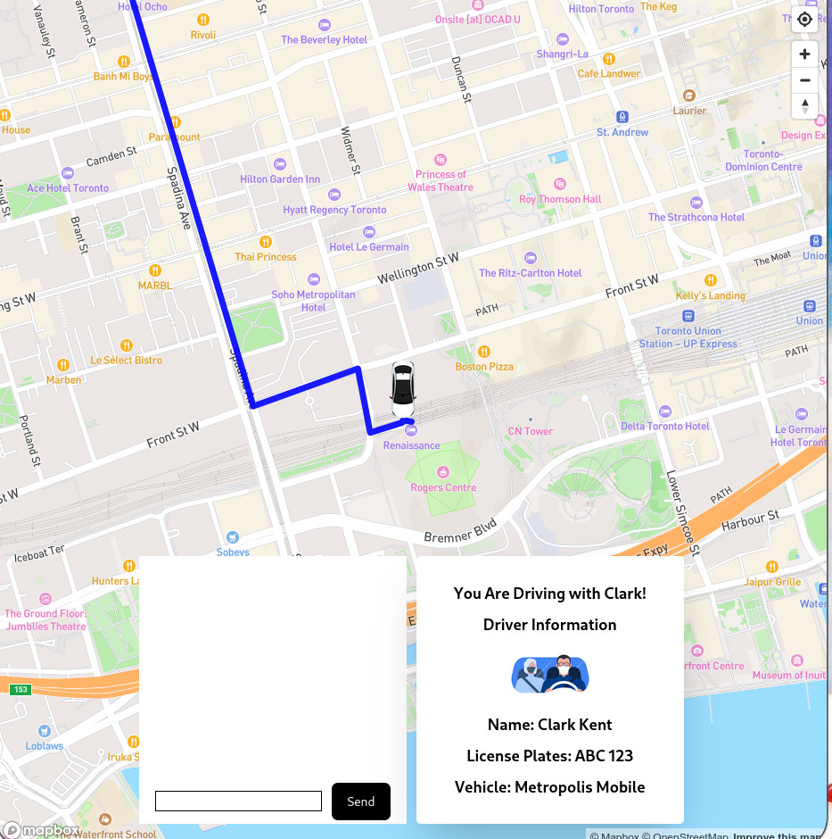

# uber-simulation-rust-react
# 1 step
first create a account on https://www.mapbox.com/ and get a key and also create a custom map to put it in the client components part
# 2 step 
to start the server put cargo run and to start the frontend put in the folder client npm run dev 

